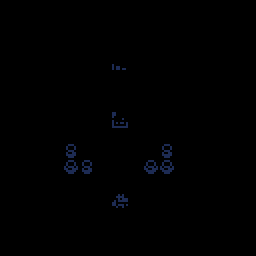
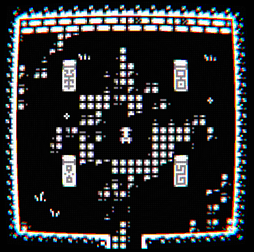

# Design Document

## Concept

You're a miner who goes down levels of a mine.
As you make your way through these levels you try to collect as much ore as you can.
However staying on one level for too long can be dangerous due to the monsters that accumulate overtime.
It's all about balancing risk vs reward to get the most out of your descent.

Each level is randomly generated with an entrance, exit, ores, and monsters.
The longer you stay in a level the more monsters will spawn.
Encouraging you to move quickly and choose your moves carefully.

 

## Style

Old school 8-bit rogue-like art style (Examples below)

  
  

 

## MoSCoW

| Must        | Should      | Could       | Won't       |
| ----------- | ----------- | ----------- | ----------- |
| ...         | ...         | ...         | ...         |

 

## MDA

### Mechanics

...

### Dynamics

...

### Aesthetics

...

 

## Tools & Resources

- Visual Studio C++
- BUAS Template Engine
- Aseprite
