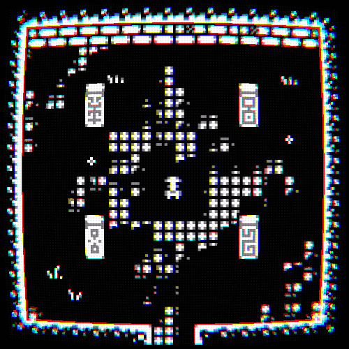

# Design Document

## Theme

``Bounce``

 

## Concept

You're a miner who goes down floors of a mine. 
As you make your way through these floors you try to collect as much ore as you can. 
However staying on one floor for too long can be dangerous due to the monsters that accumulate overtime. 
It's all about balancing risk vs reward to get the most out of your descent.

Each floor is randomly generated with an entrance, exit, ores, and monsters. 
The longer you stay in a floor the more monsters will spawn. 
Encouraging you to move quickly and choose your moves carefully.

The game is turn-based meaning that every entity moves or attacks at the same time. 
A turn only happens if the player moves, or performs an action. (like attacking)

Attacking an enemy causes them to bounce back, messing with the order which causes you to get hit if you move towards the enemy again. 
And you cannot just wait for the enemy to move towards you, so now you are motivated to perform an action to avoid being attacked.

 

## Style

Old school 8-bit rogue-like art style (Examples below)

  
  

 

## MoSCoW

| Must              | Should           | Could       | Won't              |
| ----------------- | ---------------- | ----------- | ------------------ |
| Player Controller | Shops            | More Floors | Online Multiplayer |
| Tilemap           | More Ores        |             |                    |
| Collisions        | Floor Generation |             |                    |
| Enemies           |                  |             |                    |
| Inventory         |                  |             |                    |
| Mining            |                  |             |                    |
| User Interface    |                  |             |                    |

 

## MDA

### Mechanics & Dynamics

> **Note**: 
> \<name\> <code>\<turns\></code> 
> \<description\> 
> <code>Dynamic</code> \<description\>

Turns 
The game world uses turns, each turn ``ONE`` action can be performed. 
*(Turns are advanced by, walking, attacking, mining, or using an item)* 
<code>Dynamic</code> Adds a strategic element to the game.

Walking <code>'1</code> 
The player can walk in the four cardinal directions.
*(Using WASD)* 
<code>Dynamic</code> Simple movement options within a complex environment.

Walls 
The player cannot move through walls. 
<code>Dynamic</code> Indicated by bumbing off the wall when attempting to walk into it.

Fog of War 
The player at first cannot see the whole level, it becomes visible as they explore. 
<code>Dynamic</code> Adds more discovery and risk vs reward to the exploration.

Attacking <code>'1</code> 
The player can attack an enemy by walking into them. *(Using WASD)* 
Attacking an enemy will cause them to bounce away from you. 
<code>Dynamic</code> Using the same controls for attacking.

Mining <code>'1</code> 
The player can mine ores by walking into them.
*(Using WASD)* 
<code>Dynamic</code> Using the same controls for mining.

Enemies 
Once enemies see the player they move towards them and try to attack them. 
*(Enemies attack after being attacked, e.g. killing an enemy in one hit means you don't take damage)* 
*(Enemies move after the player, so when moving into the same location the player moves)* 
<code>Dynamic</code> This attack delay means that timing is key when trying to avoid damage.

Pickups 
After being mined ores can be picked up by walking on top of them. 
<code>Dynamic</code> Showing a clear indicator that the ore has been picked up.

Shops 
The player can buys items from shops using the ores they've mined. 
*(Shops appear inbetween floors inside of a safe area)* 
<code>Dynamic</code> The player can decide how to spend their resources or save them.

### Aesthetics

``Challenge`` & ``Discovery``

 

## Tasks

<code>MUST</code> Player Controller 
Create a player that can move in the four cardinal directions. 
The player can also interact by bumping into obstacles.

<code>MUST</code> Tilemap 
Create a tilemap class for rendering the environment.

<code>MUST</code> Collisions 
Create the collision framework for tilemaps and entities.

<code>MUST</code> Enemies 
Create a generic enemy class with health, damage, and a sprite.

<code>MUST</code> Inventory 
Create an inventory for the player controller along with a GUI.

<code>MUST</code> Mining 
Add ores which the player can mine by bumping into them. 
*(The ore will be added into their inventory)*

<code>MUST</code> User Interface 
Create a main menu & pause menu for the game.

<code>SHOULD</code> Shops 
Create random shops inbetween floors where you can sell your ores for items.

<code>SHOULD</code> More Ores 
Add more unique ores to the game, that can be used in the shops.

<code>SHOULD</code> Floor Generation 
Create a procedural floor generator that creates interesting caves & dungeons.

<code>COULD</code> More Floors 
Add more floors with different visuals, ores, and enemies.

 

## Tools & Resources

- Visual Studio C++
- BUAS Template Engine
- Aseprite

